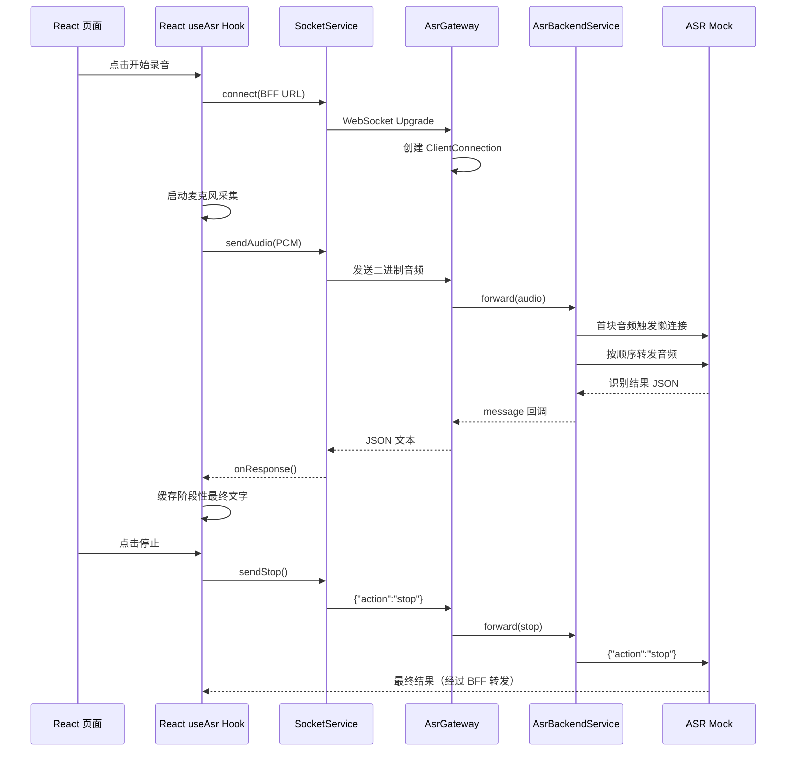

# 前端、BFF 与后端通信链路说明

## 1. 一句话概括

本项目采用两段原生 WebSocket 长连接：

```text
React 前端
   │ 原生 WebSocket
   ▼
NestJS BFF
   │ Node.js ws WebSocket
   ▼
ASR 后端（当前为 Mock 服务）
```

前端只和 BFF 通信。BFF 负责连接管理、参数和状态校验、消息转发、超时处理以及错误格式统一；真正的语音识别由后端 ASR 服务完成。

> 注意：项目使用的是原生 WebSocket，不是 Socket.IO，也没有通过 HTTP 接口上传音频。

## 2. 三个服务的职责

| 模块 | 地址 | 主要职责 |
| --- | --- | --- |
| Web H5 | `http://localhost:5173` | 采集麦克风音频、发送音频、展示识别结果 |
| BFF | `ws://localhost:3000/intelligentVoice/asr/stream` | 维护会话、校验协议、转发消息、处理超时和异常 |
| ASR Mock | `ws://localhost:3001/intelligentVoice/asr/stream` | 模拟语音识别，返回临时和最终文字 |

## 3. 通信协议

### 3.1 前端连接 BFF

```text
ws://localhost:3000/intelligentVoice/asr/stream
  ?sampleRate=16000
  &language=zh-CN
```

### 3.2 BFF 连接 ASR 后端

```text
ws://localhost:3001/intelligentVoice/asr/stream
  ?sampleRate=16000
  &language=zh-CN
```

BFF 会把前端连接时携带的 `sampleRate` 和 `language` 参数继续传给 ASR 后端。

### 3.3 消息格式

| 方向 | 数据格式 |
| --- | --- |
| 前端 -> BFF | 二进制 PCM 音频，每块 3200 字节 |
| 前端 -> BFF | 停止指令：`{"action":"stop"}` |
| BFF -> ASR | 原样转发音频或停止指令 |
| ASR -> BFF -> 前端 | JSON：`{code,msg,data:{text,isFinal}}` |

响应示例：

```json
{
  "code": 0,
  "msg": "success",
  "data": {
    "text": "你好，这是一段识别结果",
    "isFinal": false
  }
}
```

- `code === 0`：调用成功。
- `isFinal === false`：当前句子的临时识别结果。
- `isFinal === true`：当前句子的最终识别结果。

前端协议定义见 [`web-h5/src/types/protocol.ts`](../web-h5/src/types/protocol.ts)，BFF 协议定义见 [`bff-server/src/protocol/events.ts`](../bff-server/src/protocol/events.ts)。

## 4. 完整调用时序



## 5. 调用步骤和调用栈

### 5.1 点击“开始录音”

入口位于 [`web-h5/src/components/RecordButton.tsx`](../web-h5/src/components/RecordButton.tsx)。

```text
RecordButton.handleClick()
  └─ useAsr().start()
      ├─ getWebSocketUrl()
      ├─ SocketService.connect()
      │   └─ new WebSocket(BFF 地址)
      └─ AudioRecorderService.start()
          └─ navigator.mediaDevices.getUserMedia()
              └─ processor.onaudioprocess()
                  └─ onChunk()
                      └─ SocketService.sendAudio()
                          └─ WebSocket.send(ArrayBuffer)
```

具体过程：

1. `RecordButton` 根据页面状态调用 `useAsr()` 暴露的 `start()`。
2. Hook 将状态从 `idle` 改为 `connecting`。
3. `SocketService.connect()` 连接 BFF。
4. WebSocket 连接成功后，`AudioRecorderService.start()` 请求麦克风权限。
5. 麦克风数据被转换为 PCM 分片。
6. Hook 进入 `recording` 状态后，每个音频分片通过 WebSocket 发给 BFF。

相关代码：

- [`web-h5/src/hooks/useAsr.ts`](../web-h5/src/hooks/useAsr.ts)
- [`web-h5/src/services/socket.ts`](../web-h5/src/services/socket.ts)
- [`web-h5/src/services/audioRecorder.ts`](../web-h5/src/services/audioRecorder.ts)

录音服务输出的音频格式为：

```text
单声道
16 kHz
PCM 16-bit
小端序
每块 3200 字节
```

### 5.2 BFF 接受 WebSocket 连接

BFF 启动后，在 Nest HTTP Server 上监听 `upgrade` 事件。浏览器首先发起 HTTP WebSocket 握手，随后连接升级为 WebSocket 长连接。

```text
HTTP Server upgrade
  └─ AsrGateway.handleUpgrade()
      └─ WebSocketServer.handleUpgrade()
          └─ AsrGateway.handleConnection()
              ├─ parseOptions()
              ├─ SessionManager.create()
              └─ clientSocket.on("message")
                  └─ AsrGateway.handleMessage()
```

相关代码见 [`bff-server/src/asr/asr.gateway.ts`](../bff-server/src/asr/asr.gateway.ts)。

`handleConnection()` 主要完成三件事：

1. 校验 `sampleRate` 和 `language`。
2. 创建并保存当前浏览器连接对应的 `ClientConnection`。
3. 注册 `message`、`close` 和 `error` 事件。

### 5.3 BFF 会话数据

每个浏览器 WebSocket 都对应一个 `ClientConnection`：

```text
ClientConnection
  ├─ id                 唯一会话 ID
  ├─ clientSocket       浏览器 WebSocket
  ├─ options            采样率和语言
  ├─ recognitionState   idle / recognizing / stopping
  ├─ backendSocket      ASR 后端 WebSocket
  ├─ backendState       closed / connecting / open
  ├─ pendingFrames      等待发送给后端的消息
  └─ idleTimer          连接空闲计时器
```

结构定义在 [`bff-server/src/asr/session.manager.ts`](../bff-server/src/asr/session.manager.ts)。

识别状态：

```text
idle -> recognizing -> stopping -> idle
```

后端连接状态：

```text
closed -> connecting -> open
```

### 5.4 BFF 接收并转发音频

BFF 收到二进制消息时，会认为它是音频数据：

```text
AsrGateway.handleMessage()
  ├─ recognitionState = recognizing
  └─ AsrBackendService.forward(audio, true)
      ├─ 后端已连接
      │   └─ backendSocket.send(audio)
      └─ 后端未连接
          ├─ pendingFrames.push(audio)
          └─ AsrBackendService.connect()
              └─ new WebSocket(ASR 地址)
```

入口代码见 [`bff-server/src/asr/asr.gateway.ts`](../bff-server/src/asr/asr.gateway.ts)，后端连接和转发逻辑见 [`bff-server/src/asr/asr-backend.service.ts`](../bff-server/src/asr/asr-backend.service.ts)。

这里采用懒连接方式：

1. 浏览器连接 BFF 时，BFF 暂时不连接 ASR。
2. 第一块音频到达后，BFF 才创建到 ASR 的 WebSocket。
3. ASR 正在连接时，收到的音频先放进 `pendingFrames`。
4. ASR 连接成功后，BFF 按原顺序发送所有缓存帧。
5. 后续音频直接通过已经建立的后端 WebSocket 发送。

这样可以避免没有录音时占用后端连接，同时防止建立后端连接期间丢失首批音频。

### 5.5 ASR 处理音频

当前后端是一个 Mock 服务，收到二进制数据后调用：

```text
WebSocketServer.on("connection")
  └─ socket.on("message")
      └─ MockSession.onAudio()
          ├─ 校验 PCM 字节
          ├─ 生成临时文字
          └─ 返回 JSON 响应
```

代码见：

- [`asr-mock-server/src/main.ts`](../asr-mock-server/src/main.ts)
- [`asr-mock-server/src/session.ts`](../asr-mock-server/src/session.ts)

Mock 每收到三个音频分片就完成一句话：前两个分片返回 `isFinal=false`，第三个分片返回 `isFinal=true`。

### 5.6 识别结果返回前端

```text
ASR socket.on("message")
  └─ AsrBackendService
      ├─ parseAsrResponse()
      ├─ 根据响应更新识别状态
      └─ sendToBrowser()
          └─ clientSocket.send(JSON)
              └─ 前端 SocketService.onmessage
                  ├─ parseAsrResponse()
                  └─ useAsr().onResponse()
                      ├─ isFinal=false -> 忽略，不更新页面
                      ├─ 录音中的 isFinal=true -> 写入内部缓冲
                      └─ 停止后的 isFinal=true -> 合并并展示完整文字
```

BFF 的返回处理位于 [`bff-server/src/asr/asr-backend.service.ts`](../bff-server/src/asr/asr-backend.service.ts)，前端接收逻辑位于 [`web-h5/src/services/socket.ts`](../web-h5/src/services/socket.ts)，页面状态更新位于 [`web-h5/src/hooks/useAsr.ts`](../web-h5/src/hooks/useAsr.ts)。

前端收到响应后的处理规则：

- `code !== 0`：停止录音、关闭连接并进入 `error` 状态。
- `isFinal === false`：不展示中间结果。
- 录音期间的 `isFinal === true`：暂存在 Hook 内部，不更新文本框。
- 停止录音后的 `isFinal === true`：合并本次录音结果并一次性展示。
- 点击开始录音时：清空上一次文字，并显示“正在录制中...”动画。

### 5.7 点击“停止录音”

```text
RecordButton.handleClick()
  └─ useAsr().stop()
      ├─ state = stopping
      ├─ AudioRecorderService.stop()
      └─ SocketService.sendStop()
          └─ send('{"action":"stop"}')
              └─ AsrGateway.handleMessage()
                  ├─ parseControlMessage()
                  ├─ recognitionState = stopping
                  └─ BackendService.forward(stop, false)
                      └─ ASR MockSession.onControl()
                          └─ 返回 isFinal=true
```

停止操作只结束当前识别段，不会立即关闭 WebSocket：

1. 前端先停止麦克风采集。
2. 前端发送 `{"action":"stop"}`。
3. BFF 校验当前是否处于 `recognizing` 状态。
4. BFF 将状态改为 `stopping`，然后把停止指令转发给 ASR。
5. ASR 返回最后一个 `isFinal=true` 响应。
6. BFF 和前端都将识别状态恢复为 `idle`。
7. 下次点击开始录音时，可以复用现有 WebSocket 连接。

## 6. 连接关闭和异常处理

### 6.1 正常关闭

页面退出时，前端执行：

```text
window.beforeunload
  ├─ AudioRecorderService.stop()
  └─ SocketService.disconnect()
```

BFF 检测到浏览器连接关闭后执行：

```text
clientSocket.on("close")
  └─ AsrGateway.closeConnection()
      ├─ SessionManager.remove()
      └─ AsrBackendService.close()
          └─ 关闭对应的后端 WebSocket
```

因此浏览器连接和后端连接基本是一一对应的，浏览器断开时不会遗留后端连接。

### 6.2 超时处理

- 前端连接 BFF 超时：5 秒。
- BFF 连接 ASR 超时：10 秒。
- 浏览器到 BFF 连续 60 秒无消息：BFF 关闭连接。
- ASR Mock 连续 60 秒无消息：Mock 关闭连接。

配置见 [`bff-server/src/config.ts`](../bff-server/src/config.ts)。

### 6.3 BFF 错误码

| 错误码 | 含义 |
| --- | --- |
| `1001` | 连接参数不正确 |
| `1002` | 消息格式不正确 |
| `1003` | 当前识别状态不允许执行该操作 |
| `2001` | ASR 后端不可用或响应不合法 |
| `2002` | 连接 ASR 后端超时 |

BFF 会把自己的异常转换为统一的 `{code,msg,data}` 响应发给前端，前端不需要理解底层 WebSocket 或后端服务的具体异常。

## 7. BFF 在整个链路中的作用

BFF 不只是简单转发，还承担以下职责：

1. 隔离前端和真实 ASR 服务的地址及实现。
2. 校验连接参数、消息类型和识别状态。
3. 为每个浏览器维护独立的识别会话。
4. 后端连接期间缓存音频，避免丢失首批数据。
5. 处理后端连接超时和客户端空闲超时。
6. 将后端异常统一转换为前端可以理解的错误码。
7. 浏览器断开时同步关闭对应的后端连接。

因此，将来把 Mock ASR 替换为真实 ASR 服务时，主要修改 `AsrBackendService` 及其协议适配逻辑即可，前端公开协议可以保持不变。

## 8. 最精简的主调用栈

```text
开始录音：
RecordButton
  -> React useAsr Hook.start
  -> SocketService.connect
  -> AudioRecorderService.start

发送音频：
AudioRecorderService.onChunk
  -> SocketService.sendAudio
  -> AsrGateway.handleMessage
  -> AsrBackendService.forward
  -> ASR MockSession.onAudio

返回结果：
ASR WebSocket message
  -> AsrBackendService.sendToBrowser
  -> SocketService.onmessage
  -> React useAsr Hook.onResponse
  -> React 页面重新渲染

停止录音：
RecordButton
  -> React useAsr Hook.stop
  -> SocketService.sendStop
  -> AsrGateway.handleMessage
  -> AsrBackendService.forward
  -> ASR MockSession.onControl
  -> 返回最终识别结果
```
