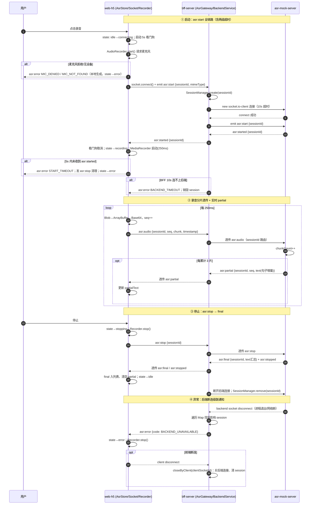
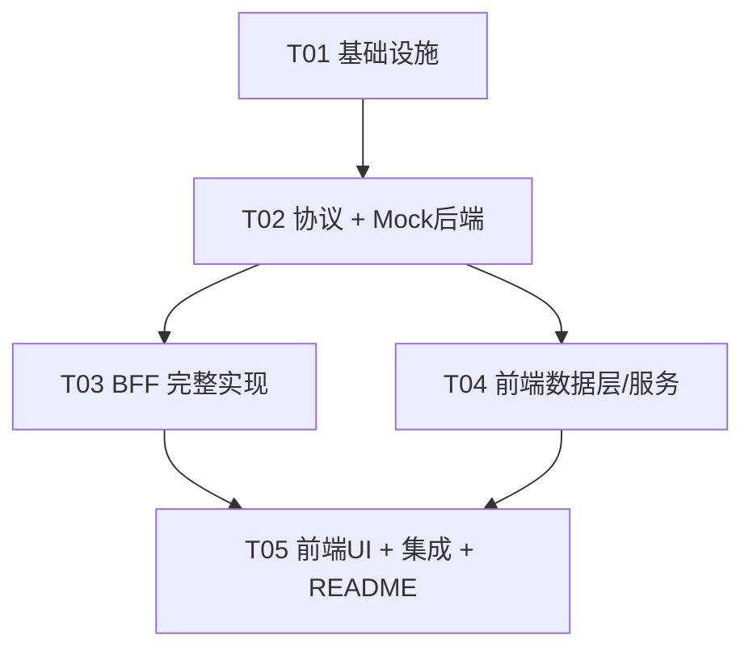

# 系统架构设计 — 语音实时转写 Monorepo（web-h5 + NestJS BFF + ASR Mock）

> 架构师：Bob（高见远） · 基于已确认 PRD 与主理人决策，一次性输出完整设计与任务分解。

---

## Part A：系统设计

### 1. 实现方案与技术选型

#### 核心难点分析

| 难点 | 应对策略 |
|------|----------|
| 双跳 WebSocket 会话路由（多前端 ↔ 单 BFF ↔ 单后端） | BFF 内部维护 `Map<sessionId, BackendSession>`，每个 sessionId 独占一条到 Mock 后端的 socket.io 连接，天然支持多客户端并发且互不串话 |
| 音频分片跨两端透传 | MediaRecorder 输出 webm/opus Blob → `ArrayBuffer` → Base64，BFF 不解码不缓存，收到即转发（zero-copy 语义） |
| 两级超时（前端 connecting 5s / BFF 等后端 10s） | 前端 store 内 `setTimeout` 看门狗；BFF 侧 `Promise.race` + 定时器，超时即清理 session 并回 `asr:error` |
| 级联断连（后端挂了 → 前端须感知） | BFF 监听后端 socket 的 `disconnect`/`connect_error`，遍历 Map 找到受影响 session，向对应前端发 `asr:error{code:BACKEND_UNAVAILABLE}` 并销毁 session |
| 前端状态机一致性 | 单一 Zustand store 集中管理 `idle → connecting → recording → stopping → idle/error`，UI 只读状态，杜绝散落的状态碎片 |

#### 框架选型（主理人决策 + 架构补充）

| 层 | 选型 | 理由 |
|----|------|------|
| 前后端 WS 协议 | **socket.io / socket.io-client**（已定） | 自动重连、事件式 API、房间语义，前后端同一套事件名 |
| BFF | **NestJS 10+**：`@nestjs/platform-socket.io` + `@WebSocketGateway` / `@SubscribeMessage` / `OnGatewayConnection` / `OnGatewayDisconnect`（已定）；BFF→后端用 `socket.io-client` | 模块化（AsrModule）、依赖注入便于单测；Gateway 与服务分离 |
| Mock 后端 | **纯 Node + socket.io（不引入 Nest）** | PRD 允许"轻量 NestJS Gateway 或 ws"二选一；Mock 只有一个 Gateway、无 DI 需求，纯 socket.io 两个文件即可跑，启动更快、依赖更少 |
| 前端 | **Vite 5 + React 18 + TypeScript + Zustand** | Vite 快；Zustand 比 Redux 轻，天然契合状态机 |
| 前端样式 | **原生 CSS（单文件 styles.css）** | Demo 级 UI（一个按钮 + 状态条 + 文本列表），不引入 MUI/Tailwind，避免配置成本与包体积 |
| Monorepo | **npm workspaces**（root package.json） | 零额外工具（不用 Turborepo/Nx），一条命令装全部依赖 |
| Mock/BFF 本地运行 | **tsx**（TS 直跑）+ tsc 仅做类型检查 | 免 build 步骤，联调启动快；BFF 也可用 `nest start` |

> 说明：三个子包**各自声明依赖**，root 只做 workspaces 聚合。协议类型文件很小，web-h5 与 bff-server **各自持有一份 `protocol.ts`**（内容一致，见"共享约定"），避免引入第四个 shared 包增加 workspace 接线复杂度。

#### 架构模式

- 前端：轻量 MVVM —— Store（状态机）为 ViewModel，组件纯渲染；Service 层（socket / audioRecorder）与 UI 解耦。
- BFF：NestJS 模块化分层 —— Gateway（协议适配）→ Service（会话与后端连接管理），Mock 侧为单文件事件循环。

---

### 2. 文件列表（monorepo，相对路径基于 `E:\nest-websocket-bff\`）

```
E:\nest-websocket-bff\
├── package.json                        # root：workspaces 声明 + 一键启动脚本
├── README.md                           # 联调启动顺序（见第 10 节）
├── docs/
│   ├── system_design.md                # 本文档
│   ├── class-diagram.mermaid
│   └── sequence-diagram.mermaid
│
├── web-h5/                             # 前端（5173）
│   ├── package.json
│   ├── vite.config.ts
│   ├── tsconfig.json
│   ├── index.html
│   └── src/
│       ├── main.tsx                    # 入口
│       ├── App.tsx                     # 页面组装
│       ├── styles.css                  # 全局样式
│       ├── types/protocol.ts           # 消息协议类型（与 BFF 保持一致）
│       ├── store/asrStore.ts           # Zustand 状态机
│       ├── services/socket.ts          # socket.io-client 封装
│       ├── services/audioRecorder.ts   # MediaRecorder 分片采集
│       └── components/
│           ├── RecordButton.tsx        # 按住/点击录音按钮（按状态机变色）
│           ├── StatusBar.tsx           # 状态 + 错误码展示
│           └── TranscriptView.tsx      # partial 实时行 + final 列表
│
├── bff-server/                         # BFF（3000，HTTP+WS 同端口）
│   ├── package.json
│   ├── tsconfig.json
│   ├── nest-cli.json
│   └── src/
│       ├── main.ts                     # NestFactory 引导，端口 3000
│       ├── app.module.ts
│       ├── config.ts                   # 常量：端口、后端地址、超时
│       ├── protocol/events.ts          # 事件名常量 + payload 类型
│       └── asr/
│           ├── asr.module.ts
│           ├── asr.gateway.ts          # 前端侧 Gateway（OnGatewayConnection/Disconnect）
│           ├── asr-backend.service.ts  # 管理到 Mock 的 socket.io-client 连接
│           └── session.manager.ts      # Map<sessionId, BackendSession> 路由表
│
└── asr-mock-server/                    # Mock ASR 后端（3001）
    ├── package.json
    ├── tsconfig.json
    └── src/
        ├── main.ts                     # socket.io Server 启动
        ├── phrases.ts                  # 中文文案池（10 句）
        └── session.ts                  # 每连接会话：3 分片→partial，stop→final
```

---

### 3. 数据结构与接口（类图）

```mermaid
classDiagram
    %% ========== 协议层（前后端共享语义） ==========
    class AsrClientEvent {
        <<enumeration>>
        asr:start
        asr:audio
        asr:stop
    }
    class AsrServerEvent {
        <<enumeration>>
        asr:started
        asr:partial
        asr:final
        asr:error
        asr:stopped
    }
    class AsrStartPayload { +sessionId: string; +mimeType?: string }
    class AsrAudioPayload { +sessionId: string; +seq: number; +chunk: string; +timestamp: number }
    class AsrStopPayload { +sessionId: string }
    class AsrStartedPayload { +sessionId: string }
    class AsrPartialPayload { +sessionId: string; +seq: number; +text: string }
    class AsrFinalPayload { +sessionId: string; +text: string }
    class AsrErrorPayload { +sessionId?: string; +code: AsrErrorCode; +message: string }
    class AsrErrorCode {
        <<enumeration>>
        MIC_DENIED / MIC_NOT_FOUND
        WS_CONNECT_FAILED / WS_DISCONNECTED
        BACKEND_UNAVAILABLE / BACKEND_TIMEOUT
        SESSION_NOT_FOUND / START_TIMEOUT / INVALID_STATE
    }

    %% ========== 前端 ==========
    class AsrUiState {
        <<enumeration>>
        idle
        connecting
        recording
        stopping
        error
    }
    class AsrStore {
        +state: AsrUiState
        +sessionId: string|null
        +partialText: string
        +finals: string[]
        +error: AsrErrorPayload|null
        +start(): Promise~void~
        +stop(): Promise~void~
        +onStarted(p): void
        +onPartial(p): void
        +onFinal(p): void
        +onError(p): void
        +onDisconnected(): void
    }
    class SocketService {
        -socket: Socket
        +connect(url: string): Promise~void~  // 5s 超时 → WS_CONNECT_FAILED
        +emitStart(p): void
        +emitAudio(p): void
        +emitStop(p): void
        +on(event, handler): void
        +disconnect(): void
    }
    class AudioRecorderService {
        -recorder: MediaRecorder
        -seq: number
        +start(onChunk: (base64: string, seq: number) => void): Promise~string~  // 返回 mimeType；250ms timeslice
        +stop(): void
    }

    %% ========== BFF ==========
    class AsrGateway {
        +handleConnection(client: Socket): void
        +handleDisconnect(client: Socket): void
        +onStart(client, p: AsrStartPayload): Promise~void~
        +onAudio(client, p: AsrAudioPayload): void
        +onStop(client, p: AsrStopPayload): void
        -notifyBackendDown(sessionId): void
    }
    class SessionManager {
        -sessions: Map~string, BackendSession~
        +create(sessionId, clientSocketId): BackendSession
        +get(sessionId): BackendSession|undefined
        +remove(sessionId): void
        +findByClient(clientSocketId): BackendSession[]
    }
    class BackendSession {
        +sessionId: string
        +clientSocketId: string
        +backendSocket: Socket  // socket.io-client → asr-mock
        +createdAt: number
    }
    class AsrBackendService {
        -sessionManager: SessionManager
        +openSession(sessionId, clientSocketId, emitToClient): Promise~void~  // 10s 超时 → BACKEND_TIMEOUT
        +forwardAudio(sessionId, p): void
        +closeSession(sessionId): void
        +closeByClient(clientSocketId): void
    }

    %% ========== Mock 后端 ==========
    class MockAsrServer {
        +PHRASES: string[]  // 10 句中文
        +handleConnection(socket): void
    }
    class MockSession {
        +chunkCount: number
        +phraseIndex: number
        +finalText: string
        +onAudio(p): void   // 每 3 片 → asr:partial（按序取句增量）
        +onStop(p): void    // → asr:final 汇总 + asr:stopped
    }

    %% ========== 关系 ==========
    AsrStore --> SocketService : 调用
    AsrStore --> AudioRecorderService : 调用
    AudioRecorderService ..> AsrAudioPayload : 产出(Base64)
    SocketService ..> AsrClientEvent : emit
    AsrGateway --> AsrBackendService : 委托
    AsrBackendService --> SessionManager : 路由
    SessionManager "1" o-- "*" BackendSession
    AsrBackendService ..> AsrServerEvent : 转发回前端
    MockAsrServer "1" *-- "*" MockSession
    MockSession ..> AsrPartialPayload : 每3分片
    MockSession ..> AsrFinalPayload : stop时
    AsrErrorPayload --> AsrErrorCode
    AsrStore --> AsrUiState
```



---

### 4. 程序调用时序（关键流程）



---

### 5. 待明确事项与已做假设

1. **音频 timeslice 假设为 250ms**：PRD 未指定分片间隔。250ms 兼顾实时性与消息频率（每秒 4 片，3 片/条 partial ≈ 0.75s 出一条增量，体感流畅）。如需调整只改 `audioRecorder.ts` 一处常量。
2. **partial 的 seq 语义假设**：`asr:partial.seq` 由 Mock 侧自增（1,2,3…），与音频分片 seq 无关；前端按到达顺序渲染即可。
3. **Base64 体积**：webm/opus 250ms 分片约 3–8KB，Base64 后 <12KB，远低于 socket.io 默认 1MB 上限，无需分块。
4. **BFF→Mock 每会话独立连接**（而非单连接多路复用）：实现最简、隔离性最好；Mock 无鉴权，无连接成本顾虑。
5. **不做重传/断线续录**：WS_DISCONNECTED 时直接报错回 idle，符合 PRD 状态机；重连后需用户重新发起。
6. **CORS**：socket.io 默认放开（demo 场景）；生产需收紧 origin。
7. **浏览器兼容**：仅保证 Chromium 系（MediaRecorder webm/opus 支持最好）；Safari 输出 mp4/aac 时透传 mimeType 但不保证 Mock 行为（反正不解析）。

---

## Part B：任务分解

### 6. 依赖包清单

**root `package.json`**
```
- (无运行时依赖) workspaces: ["web-h5", "bff-server", "asr-mock-server"]
- npm scripts: dev:h5 / dev:bff / dev:mock / dev:all（用 npm run --workspace）
```

**web-h5/**
```
- react@^18.3.1 / react-dom@^18.3.1: UI
- socket.io-client@^4.7.5: WS 客户端
- zustand@^4.5.2: 状态机 store
- (dev) vite@^5.4.0, @vitejs/plugin-react@^4.3.1, typescript@^5.5.0,
       @types/react@^18.3.0, @types/react-dom@^18.3.0
```

**bff-server/**
```
- @nestjs/common@^10.3.0, @nestjs/core@^10.3.0, @nestjs/platform-express@^10.3.0
- @nestjs/platform-socket.io@^10.3.0, @nestjs/websockets@^10.3.0: WS Gateway
- socket.io-client@^4.7.5: BFF→Mock 连接
- reflect-metadata@^0.2.0, rxjs@^7.8.0: Nest 必需
- (dev) typescript@^5.5.0, @nestjs/cli@^10.3.0, ts-node@^10.9.2,
       @types/express@^4.17.21, @types/node@^20.0.0
```

**asr-mock-server/**
```
- socket.io@^4.7.5: WS 服务端
- (dev) typescript@^5.5.0, tsx@^4.16.0, @types/node@^20.0.0
```

### 7. 任务列表（按依赖排序，可直接交工程师）

| Task ID | 任务名 | 包含文件 | 依赖 | 优先级 |
|---------|--------|----------|------|--------|
| **T01** | 项目基础设施（monorepo 骨架 + 三包入口） | `package.json`(root)、`web-h5/package.json`、`web-h5/vite.config.ts`、`web-h5/tsconfig.json`、`web-h5/index.html`、`web-h5/src/main.tsx`(占位)、`bff-server/package.json`、`bff-server/tsconfig.json`、`bff-server/nest-cli.json`、`bff-server/src/main.ts`(可启动空模块)、`bff-server/src/app.module.ts`(空)、`asr-mock-server/package.json`、`asr-mock-server/tsconfig.json`、`asr-mock-server/src/main.ts`(可启动空 Server)。验收：三个包均能 `npm run dev` 起空进程、端口正确 | — | P0 |
| **T02** | 协议定义 + Mock 后端完整实现 | `bff-server/src/protocol/events.ts`、`web-h5/src/types/protocol.ts`（两份内容一致）、`asr-mock-server/src/phrases.ts`、`asr-mock-server/src/session.ts`、`asr-mock-server/src/main.ts`（补全）。验收：用任意 socket.io 客户端连 3001，发 3 片假数据收 partial，发 stop 收 final+stopped | T01 | P0 |
| **T03** | BFF 完整实现（Gateway + 会话路由 + 级联错误） | `bff-server/src/config.ts`、`bff-server/src/asr/asr.module.ts`、`bff-server/src/asr/asr.gateway.ts`、`bff-server/src/asr/asr-backend.service.ts`、`bff-server/src/asr/session.manager.ts`、`bff-server/src/app.module.ts`（挂载 AsrModule）。验收：用脚本模拟前端打 3000，全链路 start→audio→stop 走通；杀掉 3001 时前端侧收到 BACKEND_UNAVAILABLE | T02 | P0 |
| **T04** | 前端数据层与服务（状态机 + socket + 录音） | `web-h5/src/store/asrStore.ts`、`web-h5/src/services/socket.ts`、`web-h5/src/services/audioRecorder.ts`、`web-h5/src/types/protocol.ts`（T02 已建，此处接线）。验收：store 单测/手测状态迁移完整，5s START_TIMEOUT 生效，麦克风拒绝产出 MIC_DENIED | T02 | P0 |
| **T05** | 前端 UI + 端到端集成 + README | `web-h5/src/App.tsx`、`web-h5/src/components/RecordButton.tsx`、`web-h5/src/components/StatusBar.tsx`、`web-h5/src/components/TranscriptView.tsx`、`web-h5/src/styles.css`、`web-h5/src/main.tsx`（接线）、`README.md`（启动顺序）。验收：浏览器 5173 全流程：点击→recording→partial 滚动→停止→final 入列；断 Mock 显示 BACKEND_UNAVAILABLE | T03, T04 | P0 |

### 8. 跨文件共享约定（Shared Knowledge）

```
1. 事件名一律使用常量（protocol/events.ts 导出），禁止散落字符串字面量。
2. 音频 chunk 编码：MediaRecorder Blob → ArrayBuffer → Base64 字符串；
   BFF/Mock 绝不解码、不落地存储，纯透传。
3. sessionId 由前端生成（crypto.randomUUID()），一次录音会话一个，全流程不变。
4. 所有 asr:error 统一 {sessionId?, code, message}；前端本地错误（MIC_*、
   WS_CONNECT_FAILED、START_TIMEOUT）由前端 store 自行构造，格式与后端一致。
5. 超时常量：前端 connecting/START_TIMEOUT = 5000ms；BFF 等后端 = 10000ms；
   统一定义在 config.ts / asrStore 顶部常量，不硬编码进逻辑。
6. web-h5/src/types/protocol.ts 与 bff-server/src/protocol/events.ts 内容必须
   保持同步，修改任一份时同步另一份（PR 描述中注明）。
7. 端口固定：web-h5=5173、bff=3000、asr-mock=3001；vite 无需 proxy
  （前端直连 ws://localhost:3000）。
8. 分片 timeslice = 250ms；Mock 每 3 片出 1 条 partial。
9. TypeScript 全仓 strict: true；服务端/前端均不写 any（socket payload 除外，
   用协议类型收窄）。
```

### 9. 任务依赖图



> T03 与 T04 可并行开发（均只依赖 T02 的协议），缩短关键路径。

---

### 10. 联调启动顺序建议（供 README 直接引用）

```bash
# 首次：根目录一次安装全部
npm install

# 终端 1 —— 先起 Mock 后端（BFF 启动会话时依赖它）
npm run dev:mock        # asr-mock-server → :3001

# 终端 2 —— 再起 BFF
npm run dev:bff         # bff-server → :3000

# 终端 3 —— 最后起前端
npm run dev:h5          # web-h5 → :5173，浏览器打开 http://localhost:5173

# 故障演练：Ctrl+C 杀掉 3001 → 前端应立即收到 BACKEND_UNAVAILABLE
```
